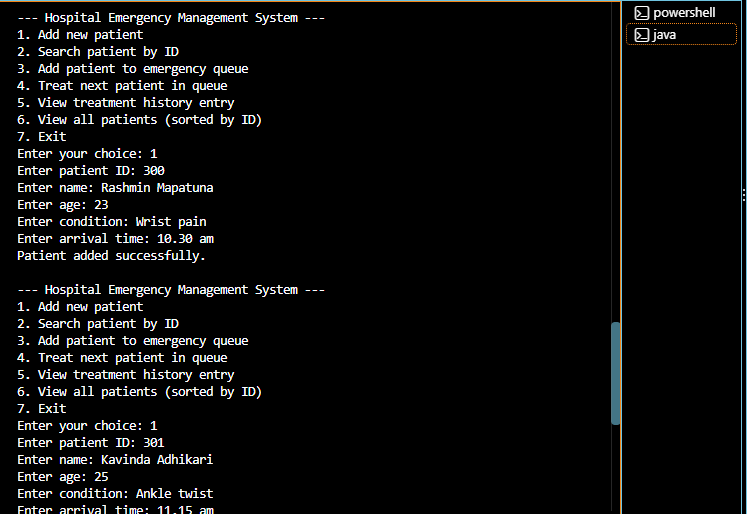
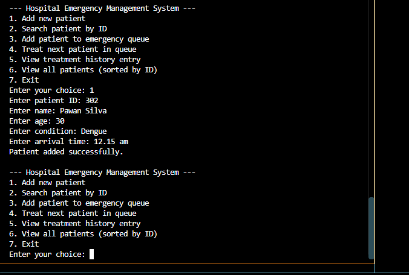
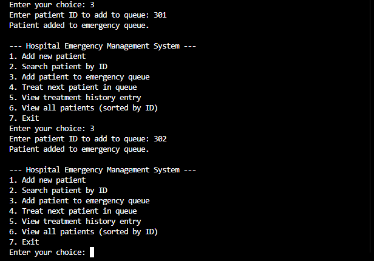
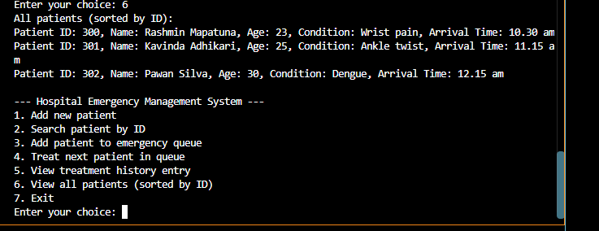

# Hospital Emergency Management System (HEMS)

CIT300 Data Structures Assignment — a Java console application that manages hospital patient records, emergency queues, treatment history, and visit history using data structures.

## Features

 **Patient Records (Binary Search Tree)** — Patients are stored in a BST keyed by Patient ID, allowing efficient insertion and search.
 **Emergency Waiting Queue (Queue)** — Patients waiting for emergency treatment are managed in a FIFO queue.
**Treatment History (Stack)** — Each patient's treatment history is tracked using a stack (LIFO).
 **Visit History (Singly Linked List)** — Each patient has a linked list recording their visit history.

## Project Structure
src/
Patient.java - Patient data model
Node.java - Generic node used in BST list

## Menu Options

Running `Main.java` presents the following menu:

1. Add new patient
2. Search patient by ID
3. Add patient to emergency queue
4. Treat next patient in queue
5. View treatment history entry
6. View all patients (sorted by ID)
7. Exit

## Screenshots

**Adding a Patient**

**Adding Patient to Emergency Queue**

**Viewing All Patients**

## Technologies mentioned

- Java
- VS Code

## Published for

Developed as part of the CIT300 Data Structures individual mid assignment.